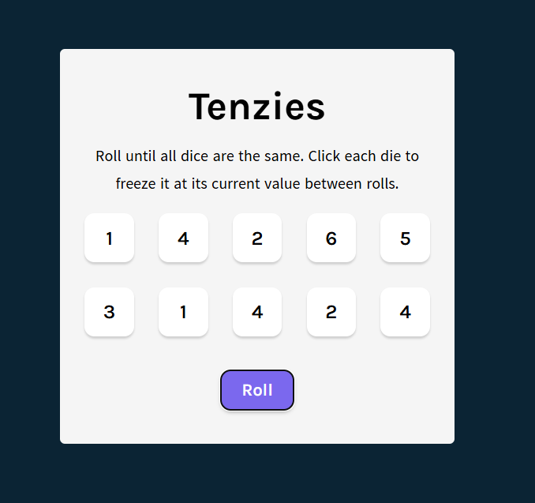

# 🎲 Tenzies App

A simple and fun dice game built with React! The goal is to roll until all dice are the same. You can freeze dice between rolls to strategically reach the target.

## 🚀 Features

- Roll 10 dice until they are all the same
- Click dice to freeze them
- Reroll unfrozen dice
- Track number of rolls and time taken
- Confetti celebration on win

## 🛠️ Built With

- React
- Vite (for project setup)
- JavaScript
- CSS

## 📸 Demo

 <!-- Optional: Replace with your actual image or remove this section -->

## 📂 Folder Structure

tenzies-app/
├── public/
├── src/
│ ├── App.jsx
│ ├── Dice.jsx
│ └── ...etc
├── .gitignore
├── README.md
├── package.json
└── index.html

## 🧪 How to Run Locally

```bash
# Clone the repository
git clone https://github.com/your-username/tenzies-app.git

# Go into the project folder
cd tenzies-app

# Install dependencies
npm install

# Start the development server
npm run dev
```
